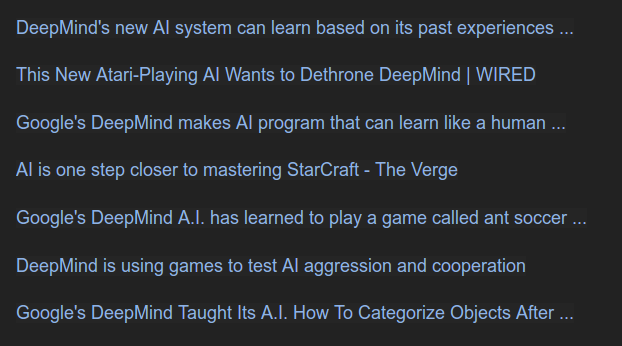

## Introduction to Data Science


**Practical Lectures** <br>
by Chris Emmery (MSc) <br>
[`@_cmry`](https://twitter.com/_cmry) &nbsp; • &nbsp; [`@cmry`](https://github.com/cmry)

<style>
body {
	color: #aaa;
}
</style>


### About Me


### Practical Notes

- Each week:
	- 2 videos: 1 lecture + 1 instructional video.
	- 1 assignment: *mandatory* but **not-graded**!
- Office hours:
	- times will be listed on [GitHub](https://github.com/tcsai/data-mining-admin/blob/master/info/schedule.md).
	- **for practical issues only!**.
- Any other questions → Discussion on Blackboard.
- **Mid-term**: 26th of september - details [here](https://github.com/tcsai/data-mining-admin/blob/master/info/schedule.md).


### Why Video Lectures?

- Discuss _practical_ side of Data Mining, rarely found in standard books.
- Due to hand-written notations in the lectures, and some practical cases in
  the instructional videos — better aligns with different learning speeds.
- Too much material for lectures only!


### What about these Instructional Videos?

- Develop a basic understanding of how to use [Jupyter](https://jupyter.org/),
  [Pandas](http://pandas.pydata.org/) and [Scikit-learn](http://scikit-learn.org/)
  for Data Mining.
- Python course will help you, but is not necessary to be able to complete the
 	assignments.
- Use 'real' data and find out best-practices and pitfalls while working on
  several interesting cases.


### ...and the Assignments?
- The assignments can be ran from the server; this does not only give you a
  (in theory) more powerful machine — it also avoids any machine-specific
	issues (yay!).
- Should get you comfortable with the scikit-learn [API](https://en.wikipedia.org/wiki/Application_programming_interface),
  and allow you to run standard pipelines given some pre-made dataset.


### What does the course cover?

- Develop a 'data science' mindset to solve data-driven problems.
- Learn about several different machine learning algorithms and their application
  to dive into data.
- Get to know 'best practices'; learn the rules and ecosystems to move
  comfortably around the field.
- Should provide you a solid foundation and a start in becoming a Data Scientist.


### What don't we cover?

- Introductory course first; overview rather than advanced subjects.
- 'Dirty work': collecting and cleaning data.
- Only basic: visualization, statistics, machine learning.
- Conducting your own research.  

> Covered in the rest of the master program!


## What is Data Science?

> Data science is a "concept to unify statistics, data analysis and their
  related methods" in order to "understand and analyze actual phenomena"
	with data.


### What makes a Data Scientist?

> Data scientists use their data and analytical ability to find and interpret
  rich data sources; manage large amounts of data (...);
	create visualizations to aid in understanding data; build mathematical models
	using the data; and present and communicate the data insights/findings.

[?](http://www.marketingdistillery.com/wp-content/uploads/2014/11/mds_f.png)


### Related Fields

|                         |                              |                      |
| ----------------------- | ---------------------------- | -------------------- |
| Artificial Intelligence |  Natural Language Processing |  VR / Sensory        |
| Machine Learning        |  Computer Vision             |  Medical             |
| Data Mining             |  Audio Signal Processing     |  Intelligent Games   |
| Information Retrieval   |  Cognitive Sciences          |  Agents (Biology)    |


### One commonality: Data-driven Science


### What is data?


### Child Interpretation

| outlook  | temp.   | windy | play |
| -------- | ------- | ----- | ---- |
| sunny    | hot     | no    | no   |
| sunny    | hot     | yes   | no   |
| sunny    | mild    | no    | yes  |
| cloudy   | hot     | no    | yes  |
| rainy    | mild    | no    | yes  |
| rainy    | cold    | yes   | no   |

It's **sunny**, **mild**, and **windy**... should I play?


### To features

| outlook  | temperature | windy | play |
| -------- | ----------- | ----- | ---- |
| 1        | 1           | 0     | 0    |

or

| sunny    | cloudy      | rainy | hot  | mild | cold | windy | play |
| -------- | ----------- | ----- | ---- | ---- | ---- | ----- | ---- |
| 1        | 0           | 0     | 1    | 0    | 0    | 0     | 0    |


### To feature vectors

$\vec{v} = \langle 1, 1, 0, 0 \rangle$

or

$\vec{v} = \langle 1, 0, 0, 1, 0, 0, 0, 0 \rangle$

> Next lecture.


### Measurements

|       | deg | feel | precip. | wsw     | uv  | thunder |
| ----- | --- | ---- | ------- | ------- | --- | ------- |
|       | 22  | 25   | 13      | 13      | 9   | 0       |
| units | °   | °    | %       | km/h    | index | %     |


### Others


Image data / combination with other data sources.


## Interpreting Data


### Back to our Data

| outlook  | temp.   | windy | play |
| -------- | ------- | ----- | ---- |
| sunny    | hot     | no    | no   |
| sunny    | hot     | yes   | no   |
| sunny    | mild    | no    | yes  |
| cloudy   | hot     | no    | yes  |
| rainy    | mild    | no    | yes  |
| rainy    | cold    | yes   | no   |

Can think of rules it's play time?


### Rules for Prediction

We want to predict our <text style="color:#d19a66">**target**</text> `play` given the <text style="color:#d19a66">**features**</text> we have
available.

> if it's windy → no play

> if it's hot and no wind → no play

> if it's not windy and not hot → play


### Formally

- We have our data: $X$ (with <text style="color:#d19a66">features</text>: outlook, temp., windy).
- Our data exists of smaller <text style="color:#d19a66">instances</text>, 'some instance' is written as: $x$.
- If we want to specifically point at a particular instance (say our first row), we write: $x_1$. We can see our model as a function $f$, that when given any instance $x$, gives us a prediction $ŷ$.
- The application of the model to some instance in our data can be written as $f(x)$.
- Our hope is that $ŷ$ is the same as our <text style="color:#d19a66">target</text>: $y$.


### Recap

- Features: $X$ (outlook, temp., windy)
- Targets: $Y$ (play)
- Some instance: $x$
- Some target: $y$
- First column: $x_1$ (sunny, hot, no)
- First target: $y_1$ (no)
- Model: <text style="color:#aaa">if it's not windy and not hot → play</text> ($f$)
- Predictions by $f(x)$: $ŷ$
- Prediction for $f(x_1)$: $ŷ_1$ (no)


### Predictive Model (or Algorithm)

> what makes an algorithm?

```python
def play_predictor(data):
	if data['windy'] == 'no' and data['temp'] != 'hot':
		return 'play'
	else:
		return 'no play'
```

It's **sunny**, **mild**, and **windy**... should I play?

Realistic?


### How do we know if our Model performs well?

- **Correct** evaluation is incredibly important in Data Mining.
- We came up with some rules, but how do we know they <text style="color:#d19a66">generalize</text>; if the rules we learned apply with the same success rate to data where we **don't** know what the <text style="color:#d19a66"> **target**</text> is.


### Let's evaluate our current Model

> if it's not windy and not hot → play

| outlook  | temp.   | windy | play |
| -------- | ------- | ----- | ---- |
| sunny    | hot     | no    | no   |
| sunny    | hot     | yes   | no   |
| sunny    | mild    | no    | yes  |
| cloudy   | hot     | no    | yes  |
| rainy    | mild    | no    | yes  |
| rainy    | cold    | yes   | no   |


### Results

- We got 5/6 correct! ☺️
	- The model has 83.3% <text style="color:#d19a66">**accuracy**</text>.
- Did we cover all conditions?
- What if we are presented with new conditions?
- Rules are probably too strict.
- Other than the <text style="color:#d19a66">**training**</text> data we determined our rules by, we also need <text style="color:#d19a66">**test**</text> data; unseen by us, to evaluate.


### Test

> if it's not windy and not hot → play

| outlook  | temp.   | windy | play |
| -------- | ------- | ----- | ---- |
| cloudy   | hot     | yes   | ?    |
| rainy    | mild    | no    | ?    |

Actual labels turned out to be: 1 - yes, 2 - no.

Accuracy: 0% - but should we update our rules?


## Realistic Use Case


### Predicting Housing Prices

- Would you be able to determine the price of a house? → Expert knowledge.
- **Many observations** required to gain experience.
- Can you come up with a few features to predict the price of a house?


### How to Evaluate?

- Previously we had a clear <text style="color:#d19a66">**binary**</text> prediction. Either yes, or no.
- Say we had more classes, we would still be predicting a <text style="color:#d19a66">**nominal target**</text> (order does not matter).
- What about a <text style="color:#d19a66">**numeric target**</text> like housing prices?
- We can't say: we got ... out of ... correct, and therefore use <text style="color:#d19a66">**accuracy**</text>.
- We are more likely interested in how far our prediction was off from the actual value: this is <text <text style="color:#d19a66">**error**</text>.


### Types of Prediction

- classes → <text style="color:#d19a66">**classification**</text>
- values → <text style="color:#d19a66">**regression**</text>


### Complex Information

- How would <text style="color:#A2BD40">location</text> affect price?
- How would <text style="color:#A2BD40">pollution</text> affect price?
- How about good <text style="color:#A2BD40">location</text> but high <text style="color:#A2BD40">pollution</text>?
- Do you know how much of either would affect the price?
- Would one be able to easily craft a successful ruleset?


### Learning to Predict

- Hand-made rules are not flexible.
- Given more <text style="color:#d19a66">**instances**</text> / **observations**, rules will become more complex, thus requiring better (more complex) rules.
- Too much data becomes impossible to manually analyse.
- If done automatically, little expert knowledge is required; **mostly** data.
- Models can give information regarding underlying patterns and <text style="color:#d19a66">**feature**</text> importances.
	- If many rules mention <text style="color:#A2BD40">location</text> as a first condition to look at, that must be an important feature.


### Machine Learning (Past)


### Machine Learning (Now v1)




### Is that all?

- Intuitions.
- Domain expertise.
- Get to know your data.


### Machine Learning (Now v2)


### Questions?

> Blackboard -> Forum


## Extra Material

Quick discussion of:

- PC hardware and relation to data and algorithms.
- Programming languages and their relation to above.

> This overview is **very** limited, but all you need to know.


### This is not Computer Science, why do I need to know this?

- Algorithm choices often depend on hardware limitations.
- Some model families specifically deal with shortage of computation power.
- Different data types often relate to storage and processing.
- Certain terms are widespread throughout this course.


### PC Hardware


#### Hard Drive I


#### Hard Drive II


#### Drives


#### Drives (HDD / SSD)

- Stores your files.
- HDD are larger (store more data, 1-5T) but slower (in reading / writing), and fragile.
- SSDs are smaller (up to 1T), faster, more robust, but expensive.
- Most modern laptops come with an SSD.
- For computation, algorithms / models read a particular set of data from your disks into **memory**.


#### Memory


#### Memory (RAM)

- Very fast reading / writing, but even more limited in space (commonly 8-16G, up to 256G), very expensive.
- Algorithms can quickly access and manipulate data that is in memory.
- If memory limit is exceeded, computers usually freeze / processes slow down.
- Computations done on data in memory are commonly handled by the **CPU**.


#### CPU I


#### CPU II


#### Processor (CPU)

- Does computation part of a computer.
- Can have multiple computation cores (duo core, quad core, etc.) to run operations in parallel (i.e. simultaneously), which speeds up processes.
- The more expensive the CPU, the faster it does similar computations. The more cores, the faster it runs parallel computations.


#### GPU


#### Graphics Card (GPU)

- Some computations can be done on a GPU rather than the CPU.
- Commonly used for processing images or other visual content. Popular for video games.
- For ordinary systems, GPU is usually embedded in the CPU.
- GPU's are very fast at 'matrix operations', and have therefore been popularized for Deep Learning research (explained in future lectures).
- Has its own RAM (and therefore limitations).


### Programming Languages

[](https://exploringdata.github.io/info/programming-languages-influence-network/)
