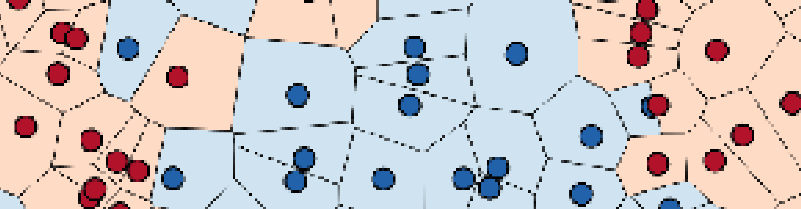

## Working With Text Data - Part I


**Practical Lectures** <br>
by Chris Emmery (MSc) <br>
[`@_cmry`](https://twitter.com/_cmry) &nbsp; • &nbsp; [`@cmry`](https://github.com/cmry)

<style>
body {
	color: #aaa;
}
</style>


### Today's Lecture

- Representing text as vectors.
- Binary vectors for Decision Tree classification.
- Using Vector Spaces and weightings.
- Document classification using $k$-NN.


### How is this Different than Before?

- Numbers are numbers. Their scales and distributions might be different; the
  information leaves little to interpretation.
- Language is complex:
  - <text style="color:#A2BD40">Representing</text> language is complex.
  - Mathematically <text style="color:#A2BD40">interpreting</text> language is complex.
  - <text style="color:#A2BD40">Inferring</text> knowledge from language is complex.
  - <text style="color:#A2BD40">Understanding</text> language is complex.


### Noisy Language

> Just netflixed pixels, best time ever lol - 1/5


### Language as a String

```csv
title,director,year,score,budget,gross,plot
"Dunkirk","Christopher Nolan",2017,8.4,100000000,183836652,"Allied soldiers from Belgium..."
"Interstellar","Christopher Nolan",2014,8.6,165000000,187991439,"A team of explorers..."
"Inception","Christopher Nolan",2010,8.8,160000000,292568851,"A thief, who steals..."
"The Prestige","Christopher Nolan",2006,8.5,40000000,53082743,"After a tragic accident..."
"Memento","Christopher Nolan",2000,8.5,9000000,25530884,"A man juggles searching..."
```


## Text to Vectors


### Converting to Numbers

$d = \text{the cat sat on the mat} \rightarrow \vec{d} = \langle ? \rangle$


### Words as Features

$d = \text{the cat sat on the mat} \rightarrow$ <br><br>
$$
\begin{bmatrix}
\text{cat} & \text{mat} & \text{on} & \text{sat} & \text{the} \newline
1          & 1          & 1         & 1          & 1         
\end{bmatrix}
$$

> <text style="color:#d19a66">Bag-of-Words</text> Representation


### Documents as Instances

$d_0 = \text{the cat sat on the mat}$ <br><br>
$d_1 = \text{my cat sat on my cat}$ <br><br>
$$
\begin{bmatrix}
\text{cat} & \text{mat} & \text{my} & \text{on} & \text{sat} & \text{the} \newline
1          & 1          & 0         & 1         & 1          & 1 \newline
1          & 0          & 1         & 1         & 1          & 0         
\end{bmatrix}
$$


### Documents * Terms

$$
V = \begin{bmatrix}
\text{cat} & \text{mat} & \text{my} & \text{on} & \text{sat} & \text{the} \newline
\end{bmatrix}
$$
<br><br>
$$
X = \begin{bmatrix}
1          & 1          & 0         & 1         & 1          & 1 \newline
1          & 0          & 1         & 1         & 1          & 0         
\end{bmatrix}
$$
<br>
- $d$ = document
- $V$ = vocabulary
- $X$ = feature space


### Document Similarity

Wikipedia articles:

| data | language | learning | mining | text | vision | $y$  |
| ---- | -------- | -------- | ------ | ---- | ------ | ---- |
| 1    | 0        | 1        | 0      | 0    | 1      | CV   |
| 1    | 1        | 1        | 0      | 1    | 0      | NLP  |
| 1    | 0        | 1        | 1      | 1    | 0      | TM   |

- CV = Computer vision
- NLP = Natural Language Processing
- TM = Text Mining


### Document Similarty - Jaccard Coefficient

<div class="container">
<div class="col">
$d_0 = \langle 1, 0, 1, 0, 0, 1 \rangle$
$d_1 = \langle 1, 1, 1, 0, 1, 0 \rangle$
$d_2 = \langle 1, 0, 1, 1, 1, 0 \rangle$
</div>
<div class="col">
$J(d_0,d_1) = 2/5 = 0.4$
$J(d_0,d_2) = 2/5 = 0.4$
$J(d_1,d_2) = 3/5 = 0.6$
</div>
</div><br>
$J(A,B) = \frac{| A \cap B |}{| A \cup B |}$

> words in A <text style="color:#A2BD40">**and**</text> B (<text style="color:#d19a66">intersection</text>) /<br> words in A <text style="color:#A2BD40">**or**</text> B (<text style="color:#d19a66">union</text>)

<style>
.container{
    display: flex;
}
.col{
    flex: 1;
}
</style>


## Decision Trees (ID3)


### Classification Rules

| data | language | learning | mining | text | vision | $y$  |
| ---- | -------- | -------- | ------ | ---- | ------ | ---- |
| 1    | 0        | 1        | 0      | 0    | 1      | CV   |
| 1    | 1        | 1        | 0      | 1    | 0      | NLP  |
| 1    | 0        | 1        | 1      | 1    | 0      | TM   |

```python
if 'vision' in d:
    label = 'CV'
else:
  if 'language' in d:
    label = 'NLP'
  else:
    label = 'TM'
```


### Inferring Rules (Decisions) by Information Gain

<small>
<div class="container">
<div class="col">
<table>
<thead>
<tr>
<th>free</th>
<th>money</th>
<th>account</th>
<th>transfer</th>
<th> $y$ </th>
</tr>
</thead>
<tbody>
<tr>
<td>1</td>
<td>1</td>
<td>0</td>
<td>0</td>
<td>spam</td>
</tr>
<tr>
<td>0</td>
<td>1</td>
<td>1</td>
<td>1</td>
<td>ham</td>
</tr>
<tr>
<td>1</td>
<td>0</td>
<td>1</td>
<td>0</td>
<td>ham</td>
</tr>
<tr>
<td>1</td>
<td>0</td>
<td>1</td>
<td>1</td>
<td>spam</td>
</tr>
<tr>
<td>0</td>
<td>1</td>
<td>0</td>
<td>1</td>
<td>spam</td>
</tr>
<tr>
<td>1</td>
<td>0</td>
<td>0</td>
<td>1</td>
<td>spam</td>
</tr>
<tr>
<td>0</td>
<td>0</td>
<td>1</td>
<td>0</td>
<td>ham</td>
</tr>
<tr>
<td>0</td>
<td>1</td>
<td>1</td>
<td>0</td>
<td>ham</td>
</tr>
<tr>
<td>0</td>
<td>1</td>
<td>0</td>
<td>0</td>
<td>spam</td>
</tr>
</tbody>
</table>
............................................................................................................. <br>
$E$ = Entropy, &nbsp; $P$ = proportion, &nbsp; $C$ = class, <br>$IG$ = Information Gain
</div>
<div class="col">
$$ E(C) = - \sum_{i=1}^n P(c_i) \log_2 P(c_i) $$
<br>
$$ E(\text{ham}) = - \left( \frac{4}{9} \cdot \log_2 \frac{4}{9} \right) $$
<br>
$$ E(\text{spam}) = - \left( \frac{5}{9} \cdot \log_2 \frac{5}{9} \right) $$
<br>
$$ E(Y) =  E(\text{ham}) + E(\text{ham}) $$
<br>
$$ E(Y) = - (-0.52) -(-0.47) $$
$$ = 0.991 $$
</div>
</div>
</small>


### Inferring Rules (Decisions) by Information Gain

<small>

|      |      |        | spam | ham | total |
| ---- | ---- | -----  | ---- | --- | ----- |
| free | 0    | &nbsp; | 2    | 3   | 5     |
|      | 1    | &nbsp; | 3    | 1   | 4     |

$$ E(\text{free}, \text{Y}) = \sum_{c \in Y} P(c) E(c) $$

$$
E(\text{free=0}, Y) =
$$
$$
-\left( P(\text{free=0, spam}) \cdot \log_2 P(\text{free=0, spam}) \right)
$$
$$
-\left( P(\text{free=0, ham}) \cdot \log_2 P(\text{free=0, ham}) \right)
$$
<br>
$$
E(\text{free=1}, Y) =
$$
$$
-\left( P(\text{free=1, spam}) \cdot \log_2 P(\text{free=1, spam}) \right)
$$
$$
                            -\left( P(\text{free=1, ham}) \cdot \log_2 P(\text{free=1, ham}) \right)
$$
<br>
$$
E(\text{free}, \text{Y}) = P(\text{free=0}) \cdot E(\text{free=0}, Y) + P(\text{free=1}) \cdot E(\text{free=1}, Y)
$$

</small>


### Inferring Rules (Decisions) by Information Gain

<small>

|      |      |        | spam | ham | total |
| ---- | ---- | -----  | ---- | --- | ----- |
| free | 0    | &nbsp; | 1    | 3   | 4     |
|      | 1    | &nbsp; | 4    | 1   | 5     |

$$ E(\text{free}, \text{Y}) = \sum_{c \in Y} P(c) E(c) $$

$$
E(\text{free=0}, Y) = - \left( \frac{1}{4} \cdot \log_2 \frac{1}{4} \right) -\left( \frac{3}{4} \cdot \log_2 \frac{3}{4} \right)
$$
<br>
$$
E(\text{free=1}, Y) = - \left( \frac{4}{5} \cdot \log_2 \frac{4}{5} \right) \cdot -\left( \frac{1}{5} \cdot \log_2 \frac{1}{5} \right)
$$

$$
E(\text{free}, \text{Y}) = \frac{4}{9} \cdot 0.811 + \frac{5}{9} \cdot 0.722 = 0.762
$$

$$
\text{IG} = E(Y) - E(\text{free}, \text{Y}) = 0.991 - 0.762 = 0.229
$$
</small>


### ID3 Algorithm

- Feature (word) with highest Information Gain will be split on first.
- Instances divided over both sides calculations will be repeated on leftovers (<text style="color:#d19a66">recursion</text>).
- If all leftover instances belong to one class, make decision.
- Create more and more rules until some stopping criterion.

> More info: [here](http://www.saedsayad.com/decision_tree.htm), [here](http://www.cs.miami.edu/home/geoff/Courses/COMP6210-10M/Content/DecisionTrees.shtml)
and [here](https://stackoverflow.com/questions/1859554/what-is-entropy-and-information-gain).


## Words in Vector Spaces


### Binary vs. Frequency

- (<text style="color:#A2BD40">**+**</text>) Binary is a very compact representation (in terms of memory).
- (<text style="color:#A2BD40">**+**</text>) Algorithms like Decision Trees have a very straight-forward and compact structure.
- (<text style="color:rgba(224, 108, 117, 1)">**-**</text>) Binary says very little about the weight of each word (feature).
- (<text style="color:rgba(224, 108, 117, 1)">**-**</text>) We can't use more advanced algorithms that work with Vector Spaces.


### Term Frequencies - Some Notation

Let $\mathbf{D} = \\{d_1, d_2, \ldots, d_N\\}\ $ be a set of documents, and
$\mathbf{T} = \\{ t_1, t_2, \ldots, t_M \\}$ (previously $V$) a set of index terms for $ \mathbf{D} $.

Each document $d_{i} \in \mathbf{D}$ can be represented as a frequency vector:

$$\vec{d}_i = \langle \text{tf}(t_1, d_i), \ldots, \text{tf}(t_M, d_i) \rangle$$

where $\text{tf}(t, d)  $ denotes the frequency of term $t_j \in \mathbf{T}$ for document
$d_i$.

Thus, $\sum^J_{j=1} d_j$ would be the word length of some document $d$.


### Term Frequencies

$d_0 = \text{the cat sat on the mat}$ <br><br>
$d_1 = \text{my cat sat on my cat}$ <br><br>
$$
T = \begin{bmatrix}
\text{cat} & \text{mat} & \text{my} & \text{on} & \text{sat} & \text{the} \newline
\end{bmatrix}
$$
<br>
$$
X = \begin{bmatrix}
1          & 1          & 0         & 1         & 1          & 1 \newline
2          & 0          & 2         & 1         & 1          & 0         
\end{bmatrix}
$$
<br>
$$ \vec{d_1} = \langle 2, 0, 2, 1, 1, 0 \rangle $$


### Term Frequencies?

```python
d0 = 'natural-language-processing.wiki'
d1 = 'information-retrieval.wiki'
d2 = 'artificial-intelligence.wiki'
d3 = 'machine-learning.wiki'
d4 = 'text-mining.wiki'
d5 = 'computer-vision.wiki'
```
<small>
<div class="container">
<div class="col">
$$t =
\begin{bmatrix}\text{learning} \newline
\end{bmatrix}
$$

$$X_t =
\begin{bmatrix}
27 \newline
2 \newline
46 \newline
134 \newline
6 \newline
10 \newline  
\end{bmatrix} \ \log(X_t) =
\begin{bmatrix}
3.33 \newline
1.10 \newline
3.85 \newline
4.91 \newline
1.95 \newline
2.40 \newline  
\end{bmatrix}
$$
</div>
<div class="col">
<ul>
<li>$\text{tf} = 10$ less important than $\text{tf} = 100$, but also $\*10$?</li>
<li>Information Theory to the rescue!</li>
<li>$\log \left( \text{tf}(t,d) + 1 \right)$
<li>Notice +1 smoothing to avoid $\log(0) = -\text{inf}$</li>
</ul>
</div>
</div>
</small>


### Some Remaining Problems

- The longer a document, the higher the probability a term will occur often,
  and will thus have more weight.
- Rare terms should actually be informative, especially if they occur amongst few
  documents.
	- If $d_1$ and $d_2$ both have $\text{cross-validation}$ in their vectors, and all the other 	  documents do not $\rightarrow$ strong similarty.

> Latter: Document Frequency


### (Inverse) Document Frequency

$$ \text{idf}_t = \log_b \frac{N}{\text{df}_t} $$

$$t =
\begin{bmatrix}\text{naive} \newline
\end{bmatrix}
$$

$$X_t =
\begin{bmatrix}
1 \newline
0 \newline
2 \newline
3 \newline
0 \newline
0 \newline  
\end{bmatrix} \ \text{df}_t = 3 \ \ \ \text{idf}_t = \log_b \frac{6}{3} = 0.30
$$

> $b$ = base = commonly 10 for $\text{idf}$


### Putting it Together: $\text{tf}\*\text{idf}$ weighting

$$w_{t,d} = \log \left( \text{tf}(t,d) + 1 \right) \cdot \log_b \frac{N}{\text{df}_t}$$

| $d$ | learning             | text                   | language | intelligence         |
| --: | -------------------: | ---------------------: | -------: | -------------------: |
| 0   | 5 $\rightarrow$ 0.32 | 1                      | 10       | 0                    |
| 1   | 2                    | 21 $\rightarrow$  0.0  | 6        | 0                    |
| 2   | 0                    | 3                      | 0        | 1 $\rightarrow$ 0.33 |


### Normalizing Vector Representations

- We fixed the global information per $\text{document} * \text{term}$ instance.
- Despite $\text{tf}\*\text{idf}$, we still don't account for the **length** of documents (i.e. the amount of words in total).
- Why is this an issue?


## $k$-Nearest Neighbours




### Euclidean Distance

$$d(\vec{x}, \vec{y}) = \sqrt{\sum^n_{i=1} (\vec{x}_i - \vec{y}_i)^2}$$

> Documents with many words are far away.


### $\ell_2$ Normalization

$$|| \vec{x} ||\_2 = \sqrt{\sum_i x_i^2}$$

> Divide all feature values by norm.


### Cosine Similarity

$\vec{a} \bullet \vec{b} = \sum^{n}_{i=1} \vec{a}_i \vec{b}_i = \vec{a}_1 \vec{b}_1 + \vec{a}_2 \vec{b}_2 + \ldots + \vec{a}_n \vec{b}_n$

> Under the $\ell_2$ norm only (otherwise normalize vectors before)!


### Using Similarity in $k$-NN

- Store the complete training matrix $X\_{\text{train}}$ in memory.
- Calculate cosine / euclidean metric between a given $\vec{x}\_\text{test}$ and all $\vec{x}\_\text{train} \in X\_\text{train}$.
- Choose the $k$ vectors from $X\_{train}$  with the highest similarity to $\vec{x}\_\text{test}$.
- Look up the labels for these $k$ vectors, take majority label $\rightarrow$ this
  is the classification.


### Augmentations to $k$-NN

- Use different metrics.
- Weight labels by:
	- Frequency (majority preferred).
	- Inverse frequency (rarer preferred).
	- Distance (closer instances count heavier).

> Weightings avoid ties!


## Questions?

> Blackboard → Forum
