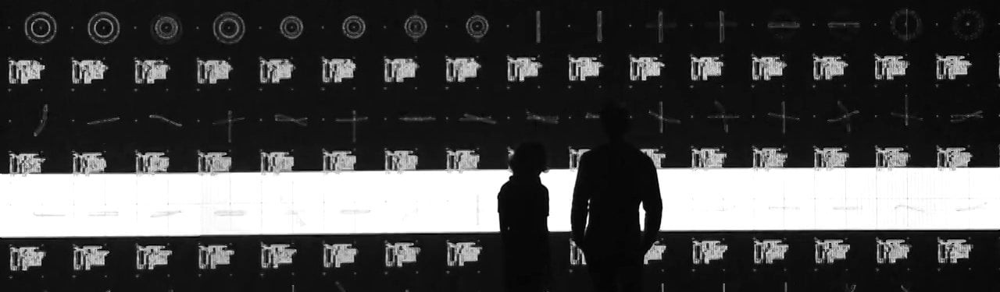

## Mining Massive Data


**Practical Lectures**<br>
by Chris Emmery (MSc)<br>
[`@_cmry`](https://twitter.com/_cmry) &nbsp; • &nbsp; [`@cmry`](https://github.com/cmry)

<style>
body {
    color: #aaa;
}
</style>


### This Lecture

- Parallelization
- Bagging, Boosting, and Batching
  - Random Forests
  - AdaBoost
  - Online Learning
- Distributed Computing
  - DFS + MapReduce

<small>

<p style="white-space:nowrap;">Images (Licensed for reuse) are work by a.o. [Ryoji Ikeda](http://www.ryojiikeda.com/project/datamatics/)</p>

</small>


### Problem Statement

- One machine.
- Limited resources.
- Data costs memory.
- Algorithms cost CPU power.
- Tuning costs more of both.

What if we run out?


### Four Options

- Run several processes at the same time (<text style="color:#d19a66">Parallelization</text>).
- Using less data but combining multiple models (<text style="color:#d19a66">Bagging</text>).
- Use algorithms that can train incrementally (<text style="color:#d19a66">Batching</text>).
- Divide all tasks over multiple machines (<text style="color:#d19a66">Distributing</text>).


## Parallelization


### `n_jobs` = Magic Speed-Up?

In e.g. Grid Search, Cross-Validation, (multi-class) Logistic Regression, $k$-means (with multiple initializations)...


### How does parallelization work?

- We need (preferably):
  - A shared (data) object.
  - Multiple similar (but slightly different) tasks.
  - Not altering the object itself while doing computations.

```
[[ 3,  4, 10,  1,  1,  8,  5,  9,  9,  4],
 [ 5,  1,  1,  6,  2,  6,  6,  6,  6,  4],
 [10,  5,  5, 10,  3,  5,  1,  7,  5,  7],
 [ 2,  7,  2,  5,  6,  7,  6, 10, 10,  5],
 [ 6,  5,  3,  4,  5,  9, 10,  2,  1,  2],
 [ 6,  1,  1,  2,  8,  7,  2,  4, 10,  7],
 [ 4,  8,  7,  7,  3,  9,  9,  8,  6,  3],
 [ 9,  1, 10, 10,  4,  7,  3,  6,  1,  6],
 [ 2,  6,  8,  7,  2,  8, 10,  6, 10,  2],
 [ 2,  7,  2,  9,  8,  9,  9,  7,  4,  5]]
```


### How does parallelization work?

- Cross-Validation
- Grid Search
- both?


### How do we make Algorithms parallel?


## Bagging, Boosting, and Batching




### Ensemble Methods

- <text style="color:#A2BD40">Boosting</text>: iteratively stack models to
  reduce the bias of its combination.
  (e.g. <text style="color:#d19a66">AdaBoost</text>)
- <text style="color:#A2BD40">Averaging</text>: build many different models with
  the same algorithm, on data samples, aggregate their predictions (e.g. <text
  style="color:#d19a66">Bagging</text>, <text style="color:#d19a66">Random
  Forests</text>).

> Speed-up, lower memory, lower bias.


### Boosting: AdaBoost

- Sample data in one bag.
- Train on bag → test on train → identify difficult instances →
  re-weight → new bag.
- Repeat until done.
- Average predictions.
- Single algorithm - parallel? <text style="color:#222">no</text>

> Reduces bias, strong final models.


### Bagging

- Sample data in multiple bags.
- Train model per bag.
- Average predictions.
- Can be single algorithm or various.
- Parallel per sample.

> Random Forest: In addition to random sample, also choose random features for each node.


### How does this help?

- Fitting models is costly: train many smaller models.
- However, what if we can't fit your data into memory?
  - Bagging can be done on smaller samples of all data.
  - After fitting, data doesn't need to be stored.
  - Multiple smaller classifiers make decision.


### Batching (Online Learning)

- Feed our data per instance, or in batches.
- Requires models that don't need access to all data.
  - Naive Bayes
  - Neural Networks


### Drawbacks

- Single machine:
  - Bagging: reduces CPU and / or MEM.
  - Online: require specific algorithms.
- Both (might) take longer.
- Online could still run out of MEM.


## Distributed Computing


### Distributing ML

- Bagging: sample per machine.
- Online: stream to multiple machines.
- When done: aggregate or distribute predictions.

> Solves our ML part, but what if we need all our data for e.g. feature extraction?


### Towards current 'Big Data' 'Landscape'

- '03-'04: [Google File System](https://research.google.com/archive/gfs.html) and [MapReduce](https://research.google.com/archive/mapreduce.html).
- After:


> Do I need this?


### Distributed File Storage

<br><br><br><br><br><br><br><br>


### MapReduce

<br><br><br><br><br><br><br><br><br><small>

> Many ML algorithms can be implemented / approximated using MapReduce (see e.g. Apache Mahout, Storm, Spark)

</small>


## Questions?

> Blackboard → Forum
